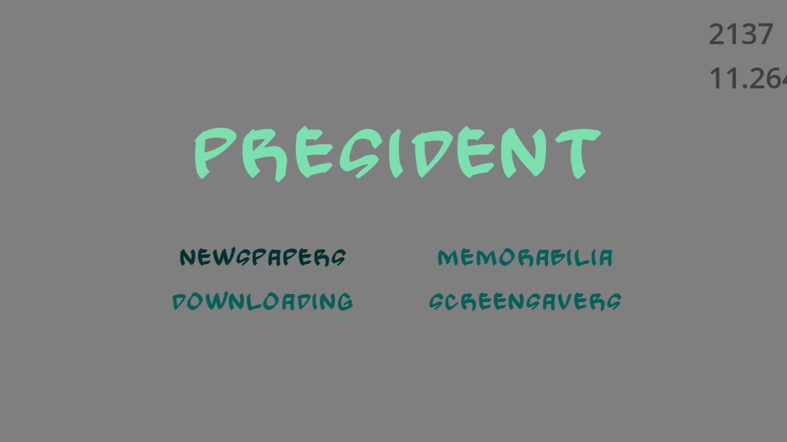

# Wordfinder

Author: Jonathan Yan

Design: A word-based game where the goal is to find the word with as little overlap of characters as possible!

Text Drawing: Fonts are loaded once into a Font object. Each Font object can generate Text objects, which represent an immutable rendered string. This Text object can be reused without expensive calculations. Properties such as size and data can be inputted when drawing the Text, allowing it to be changed. Lastly, a Font object caches the rendered textures of each glyph, reducing recalculation times.

Screen Shot:

How To Play:

Left/Right arrows to change selections, space to select a word. The score increases if there are few common characters between your selected word and the presented word, as well as based on the time remaining.

Sources:

Words font: https://www.fontsquirrel.com/fonts/Gong
Menu font: https://www.fontsquirrel.com/fonts/open-sans
Word list: https://github.com/first20hours/google-10000-english

This game was built with [NEST](NEST.md).

